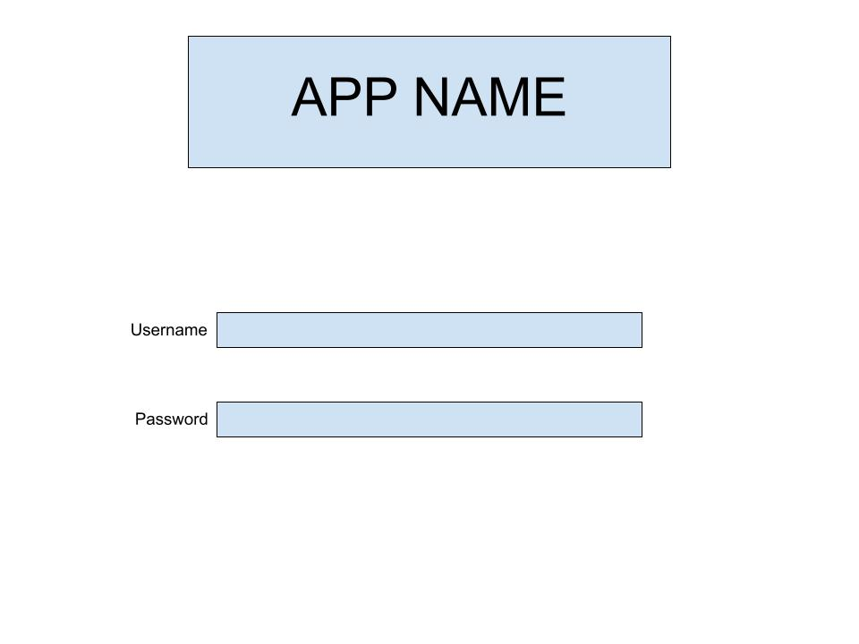

# Project 4
A platform to look up music, add songs to a playlist, favorite a song!

## User Stories
#### Registered user
##### Sign in/out, account information routes
* As a registered user, I want to be able to sign in
* As a registered user, I want to be able to sign out
* As a registered user, I want to be able to change my password

##### All songs
* As a registered user, I expect to view a list of songs
* As a registered user, I expect to be able to click on a song and see more info
* As a registered user, I want to be able to search for a song or songs
* As a registered user, I want to be able to filter by genre

##### Favorite Songs
* As a registered user, I want to be able to be able to add songs to my favorite list

##### Playlists
* As a registered user, I want to be able to be able to create a playlist
* As a registered user, I want to be able to be able to delete a playlist
* As a registered user, I want to be able to be able to add and remove songs from a playlist

##### Stretch
* As a registered user, I want to be able to like a song and remove my like
* As a registered user, I want to be able to rate a song
* As a registered user, I want to be able to be able create and delete a song
* As a registered user, I want to be able to follow an artist

#### Unregistered user
* As a unregistered user, I want to be able to sign up/create account
* As a unregistered user, I expect to view a list of songs
* As a unregistered user, I expect to be able to click on a song and see more info and comments/reviews
* As a unregistered user, I want to be able to search for a song
* As a unregistered user, I want to be able to see the song club song

## Wireframes

## ERD

Playlists {
    name: {type: String, required: true},
    description: String,
    playlistImageUrl: String,
    user: {
        type: Schema.Types.ObjectId
        ref: user
    }
}

FavoritesList {
    user: {
        type: Schema.Types.ObjectId
        ref: user
    },
    song: String
}

<!-- FollowList {
    user: {
        type: Schema.Types.ObjectId
        ref: user
    },
    artist: String
} -->

## API
#### Last FM API I may use
All api links below start with: http://ws.audioscrobbler.com

* Last FM Top Artists API:
/2.0/?method=chart.gettopartists&api_key=YOUR_API_KEY&format=json

* Last FM Top Songs API:
/2.0/?method=chart.gettoptracks&api_key=YOUR_API_KEY&format=json

* Last FM Top Albums API:
/2.0/?method=artist.gettopalbums&artist=cher&api_key=YOUR_API_KEY&format=json

* Last FM Artist Info API:
/2.0/?method=artist.getinfo&artist=Cher&api_key=YOUR_API_KEY&format=json

* Last FM Song Info API:
/2.0/?method=track.getInfo&api_key=YOUR_API_KEY&artist=cher&track=believe&format=json

* Last FM Album Info API:
 /2.0/?method=album.getinfo&api_key=YOUR_API_KEY&artist=Cher&album=Believe&format=json

* Last FM Get Similar Artists API:
/2.0/?method=artist.getsimilar&artist=cher&api_key=YOUR_API_KEY&format=json

* Last FM Get Similar Songs API:
/2.0/?method=track.getsimilar&artist=cher&track=believe&api_key=YOUR_API_KEY&format=json

* Last FM Search Artists API:
/2.0/?method=artist.search&artist=cher&api_key=YOUR_API_KEY&format=json

* Last FM Search Albums API:
/2.0/?method=artist.search&artist=cher&api_key=YOUR_API_KEY&format=json

* Last FM Search Songs API:
/2.0/?method=track.search&track=Believe&api_key=YOUR_API_KEY&format=json

API KEY will be in .env file

## Routes
### User Routes
| Verb   | URI Pattern            | Description |
|--------|------------------------|-------------------|
| POST   | `/sign-up`             | create account  |
| POST   | `/sign-in`             | sign into account   |
| PATCH  | `/change-password/` | change password  |
| DELETE | `/sign-out/`        | signout  |

### Index Routes
| Verb   | URI Pattern            | Description |
|--------|------------------------|-------------------|
| GET   | `/`             | show index   |
| GET   | `/music/`             | show list of songs and artists   |

### Artists Routes
| Verb   | URI Pattern            | Description |
|--------|------------------------|-------------------|
| GET   | `/artist/:id`             | show artist  |

### Songs Routes
| Verb   | URI Pattern            | Description |
|--------|------------------------|-------------------|
| GET   | `/song/:id`             | show song  |

### Albums Routes
| Verb   | URI Pattern            | Description |
|--------|------------------------|-------------------|
| GET   | `/album/:id`             | show album  |

### Playlists Routes
| Verb   | URI Pattern            | Description |
|--------|------------------------|-------------------|
| POST   | `/playlists/`             | create a playlist    |
| GET   | `/playlists/`             | view all playlists    |
| GET   | `/playlists/:playlistId`  | view a playlist    |
| PATCH  | `/playlists/:playlistId` | update a playlist  |
| DELETE | `/playlists/:playlistId`        | delete a playlist   |

### Favorites Routes
| Verb   | URI Pattern            | Description |
|--------|------------------------|-------------------|
| GET   | `/favorites`             | see all favorites   |
| POST   | `/favorites/:id`             | add song to favorites   |
| DELETE | `/favorites/:id`        | remove song from favorites   |

<!-- ### Follow Routes
| Verb   | URI Pattern            | Description |
|--------|------------------------|-------------------|
| GET   | `/follow`             | see all artists that I follow   |
| POST   | `/follow/:id`             | follow an artist  |
| DELETE | `/follow/:id`        | unfollow an artist  | -->